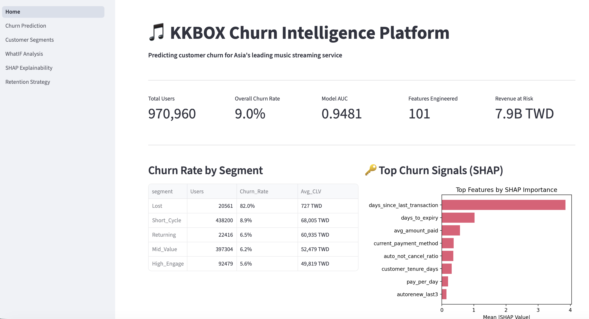
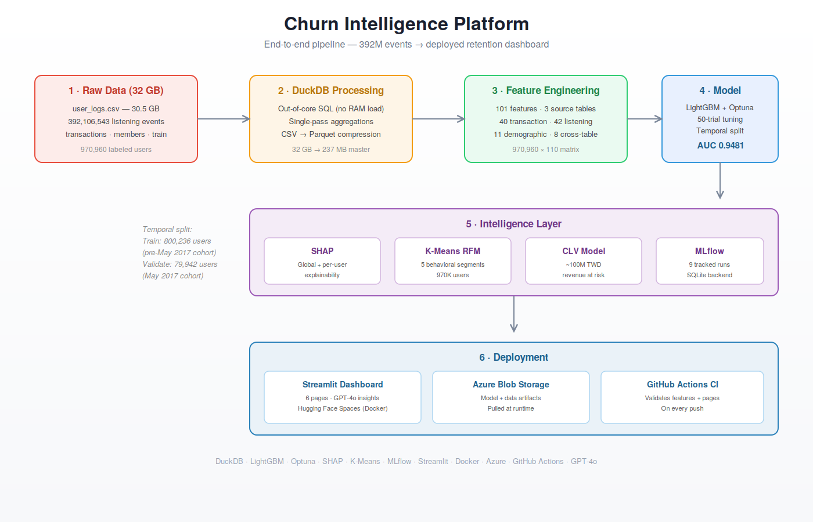
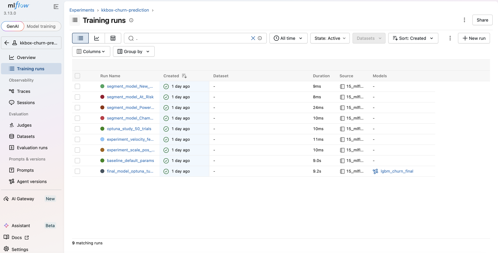
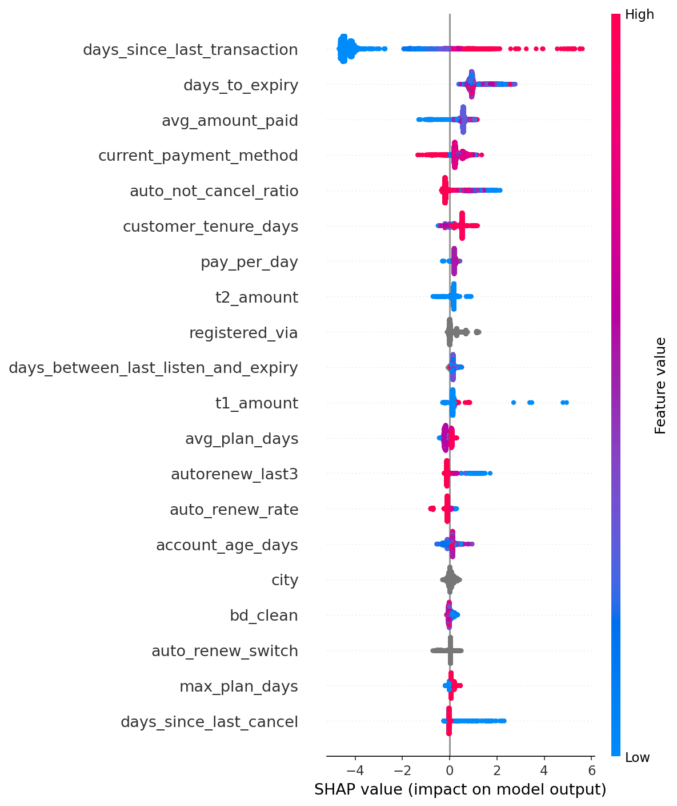

# 🎵 KKBOX Churn Intelligence Platform

> End-to-end customer churn prediction for Asia's leading music streaming service — from 30GB raw logs to a deployed AI-powered retention dashboard with a live REST API.

[](https://huggingface.co/spaces/harshith02/kkbox-churn-intelligence)
[](http://54.174.122.16:8001/docs)
[](https://github.com/HarshithNR02/KKBOX-Subscription-churn-Retention-Engine)
[](https://python.org)
[](https://lightgbm.readthedocs.io)

---

## 🚀 Live Demo

**[→ Launch KKBOX Churn Intelligence Dashboard](https://huggingface.co/spaces/harshith02/kkbox-churn-intelligence)**

> **Note:** Hosted on Hugging Face Spaces (free tier) — may take 30–60 seconds to wake up on first visit.

**[→ Live REST API](http://54.174.122.16:8001/docs)** — deployed on AWS EC2

---

## 🏆 Results

| Metric | Value |
|--------|-------|
| **ROC-AUC** | **0.9481** (temporal hold-out, May 2017 cohort) |
| PR-AUC | 0.4287 |
| Features engineered | **101** (across 3 tables) |
| Training users | 800,236 (pre-May 2017 cohort) |
| Validation users | 79,942 (May 2017 cohort) |
| Estimated revenue at risk (CLV-weighted) | **~100M TWD** |

---



---

## 🔌 REST API

Live on AWS EC2: `http://54.174.122.16:8001/docs`

Two prediction endpoints:

**POST /predict/user** — pass a user ID, look up pre-computed features from DuckDB, return churn probability:

```json
{"msno": "ugx0CjOMzazClkFzU2xasmDZaoIqOUAZPsH1q0teWCg="}
```

**POST /predict/features** — pass raw behavioral features directly, return churn probability:

```json
{
  "days_since_last_transaction": 14,
  "days_to_expiry": 15,
  "auto_not_cancel_ratio": 0.9,
  "current_auto_renew": 1
}
```

**Architecture:** Model (~5MB) loads into RAM at startup. Feature store (198MB, 970K users x 101 features) stays on disk — DuckDB queries one user row per request. Zero memory pressure on a 1GB server.

---

## 📊 Dataset

**WSDM 2018 Kaggle Competition — KKBOX Music Streaming Churn Prediction**

| File | Size | Rows | Description |
|------|------|------|-------------|
| `train_v2.csv` | 45.6 MB | 970,960 | Labeled users, 8.99% churn rate |
| `transactions.csv` | 1.73 GB | 21,547,746 | Payment and subscription records |
| `user_logs.csv` | 30.51 GB | 392,106,543 | Daily listening events |
| `members_v3.csv` | 427.9 MB | 6,769,473 | User demographics |

**Key engineering challenge:** 30.51 GB of raw CSV — 392M listening events — processed entirely out-of-core using DuckDB without loading into RAM. Compressed to Parquet (master dataset: 237 MB).

---

## 🏗️ Project Architecture



```text
Raw CSVs (30+ GB, 392M listening events)
    ↓ DuckDB out-of-core processing
Parquet files (237 MB master dataset)
    ↓ Feature engineering (101 features, 3 tables)
Master dataset (970,960 x 110)
    ↓ Temporal split: pre-May 2017 train → May 2017 validation
LightGBM + Optuna (50 trials)
    ↓ AUC 0.9481
SHAP + K-Means RFM + CLV
    ↓
Streamlit dashboard (Azure Blob + Hugging Face Spaces)
FastAPI REST API (AWS EC2, port 8001)
```

---

## Notebooks

| Notebook | Description |
|----------|-------------|
| `00_dataset_exploration` | Schema check, row counts, null analysis |
| `01_data_inventory` | Data quality verification |
| `02_csv_to_parquet` | DuckDB compression, Parquet conversion |
| `03_eda_members` | Demographics, registration channel analysis |
| `04_eda_transactions` | Auto-renew signals, payment patterns |
| `05_eda_user_logs` | 392M row listening behavior analysis with DuckDB |
| `06a_transactions_features` | 40 transaction features via single-pass DuckDB SQL |
| `06b_members_features` | 11 demographic features |
| `06c_logs_features` | 42 listening features, multi-window aggregations |
| `07_master_dataset` | 3-table join, 8 cross-table interaction features |
| `08_baseline_model` | Temporal split diagnosis, model comparison |
| `09_optuna_training` | 50-trial Bayesian hyperparameter optimization |
| `10_final_model` | Final LightGBM + ablation study (zero-importance feature analysis) |
| `11_shap` | Global + waterfall SHAP explanations |
| `12_clustering` | K-Means RFM segmentation, K=5 elbow method |
| `13_segment_models` | Segment-specific model experiments |
| `14_clv` | Customer Lifetime Value estimation |
| `15_mlflow` | Experiment tracking — 9 runs logged |

---



---

## Top 5 Features (SHAP)

| Feature | Mean |SHAP| | Business Meaning |
|---------|--------------|-----------------|
| `days_since_last_transaction` | 3.85 | Dominant signal — no transaction in 30+ days strongly predicts churn |
| `days_to_expiry` | 1.02 | Plans expiring without auto-renew = elevated risk |
| `avg_amount_paid` | 0.57 | Higher payers are more loyal |
| `auto_not_cancel_ratio` | 0.36 | Users who always auto-renew and never cancel = lowest risk |
| `customer_tenure_days` | 0.31 | Longer tenure correlates with lower churn probability |



---

## Customer Segments (K-Means RFM)

| Segment | Users | Actual Churn Rate | Median Churn Prob | Avg CLV | Action |
|---------|-------|-------------------|-------------------|---------|--------|
| **Lost** | 20,561 | 81.9% | 99.1% | 727 TWD | Write off — CAC > CLV |
| **Short_Cycle** | 438,200 | 8.9% | 0.05% | 68,005 TWD | No action — auto-renewing |
| **Returning** | 22,416 | 6.5% | 0.20% | 60,935 TWD | Engagement campaign |
| **Mid_Value** | 397,304 | 6.2% | 1.83% | 52,479 TWD | Targeted discount |
| **High_Engage** | 92,479 | 5.6% | 1.48% | 49,819 TWD | Premium upsell |

> **Note:** Median churn probability and actual churn rate differ due to a known distribution shift between the pre-May 2017 training cohort (1.65% churn) and May 2017 validation cohort (5.02% churn). The model ranks users correctly (AUC 0.9481) but absolute probability estimates reflect training distribution.

---

## Dashboard Features

1. **Home** — KPIs, segment overview, SHAP feature importance
2. **Churn Prediction** — Look up any of 970K users by ID — instant risk score, CLV, recommended action
3. **Customer Segments** — Interactive segment analysis with revenue at risk breakdown
4. **What-If Analysis** — Manually adjust features to explore how behavioral changes affect churn risk
5. **SHAP Explainability** — Global importance + individual waterfall plots
6. **Retention Strategy** — Priority matrix, ROI calculator, GPT-4o AI recommendations

---

## Tech Stack

| Category | Tools |
|----------|-------|
| Data Engineering | DuckDB, Pandas, PyArrow |
| ML | LightGBM, Scikit-learn, Optuna, SHAP |
| Experiment Tracking | MLflow (SQLite backend, 9 runs) |
| API | FastAPI, Uvicorn, Pydantic |
| Deployment | Streamlit, Docker, Hugging Face Spaces, AWS EC2, S3, IAM |
| Cloud Storage | Azure Blob Storage |
| AI | OpenAI GPT-4o |
| Language | Python 3.11 |

---

## Key EDA Findings

- **Auto-renew OFF → 42.7% churn** vs ON → 4.5% churn (9.4x difference, strongest transaction signal)
- **Listening drop-off signal** — churn rises from 6.4% (0-3 days silent) to 34.3% (15-30 days silent)
- **Last month churners → 67.7% churn again** — strongest cross-month signal
- **Registration channel 4 → 23.1% churn** vs channel 7 → 4.5% (strongest demographic signal)
- **Auto OFF + inactive 30d+ → 95.6% churn** — highest-precision cross-table signal

---

## Honest Notes

- **Distribution shift:** Training cohort churn rate 1.65% vs validation cohort 5.02%. Model ranks correctly (AUC 0.9481) but absolute probabilities reflect training distribution.
- **Ablation study:** 10 features showed zero split importance AND zero SHAP importance. Removing them dropped AUC from 0.9481 → 0.9455 — evidence of interaction effects. Kept all 101 features based on empirical validation.
- **Portfolio-grade, not production-grade.** Scoped out: auth, rate limiting, HTTPS. Easy to add for real traffic.

---

## Running Locally

```bash
git clone https://github.com/HarshithNR02/KKBOX-Subscription-churn-Retention-Engine.git
cd KKBOX-Subscription-churn-Retention-Engine/app
pip install -r requirements.txt

# Add your keys to .env
echo "OPENAI_API_KEY=your-key" > .env
echo "AZURE_CONNECTION_STRING=your-connection-string" >> .env

streamlit run Home.py
```

> **Note:** Requires data files from the WSDM 2018 Kaggle competition processed through notebooks 00-07, or Azure connection string to download pre-processed files.

---

## Author

**Harshith Nerlikere Ramesh**
MS Data Science, UMass Dartmouth (2026)
[GitHub](https://github.com/HarshithNR02) | [LinkedIn](https://linkedin.com/in/harshithnr2002)